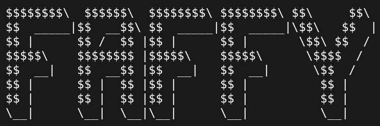

<p align="center">

</p>

# What This Is
Faffy is a no-faff small and lightweight single c-file terminal emulator based on GTK written in C. It has no crazy features it's just designed to be simple and reliable. The shell it uses, all the keybinds plus custom keybinds, the font and font size it uses, and the foreground and background color and the entire ansi palette it uses is completely customizable in the *config.h*. It should work on most linux distros and was initially developed in a single day as a small side project because I always wanted a terminal emulator like this.

# Some Remarks
In the default configuration **CTRL + C** and **CTRL + V** work as the standard clipboard keybinds, no need to awkwardly press shift just to paste and copy stuff. **CTRL + C** still works as a keyboard interrupt if you have no text selected. Here is an overview of all default keybinds:

| Keybind | Action |
| --- | --- |
| CTRL + Plus/Equals | Zoom In |
| CTRL + Minus | Zoom Out |
| CTRL + 0 | Reset Zoom |
| CTRL + C | Copy (if no text is selected still acts as Keyboard Interrupt) |
| CTRL + V | Paste |
| CTRL + I | Keyboard Interrupt |
| CTRL + E | Exit |
| CTRL + SHIFT + C| Clear |

> Side Note: You can also define custom keybinds to run specific commands

# Building & Installing
Make sure you have gcc and make installed on your system.  
Then just clone the repo and run:
```
make install-dependencies
```
This will install the required dependencies for most linux distros, but if your distro is not recognized you have to manually install the headers for GTK3 and VTE-2.91 for your distro.  
  
Then make sure to customize the *config.h* to your liking.  
  
Then just run:
```
sudo make export
```
This will build Faffy and export it to your system. Every time you change something in the config you ofcourse have to rebuild Faffy and therefore have to rerun this command.
